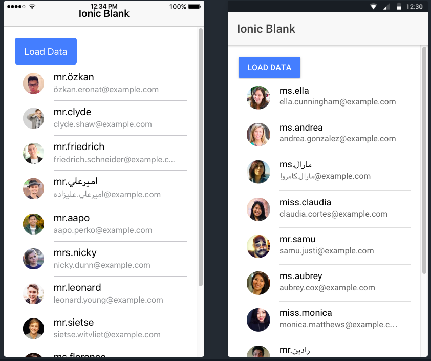

# Angular 4.3 HttpClient (Accessing REST Web Services With Angular)

In Angular 4.3 the new HttpClientModule has been introduced. This new module is available in package @angular/common/http and a complete re-implementation of the former HttpModule. The new HttpClient service is included in HttpClientModule and can be used to initiate HTTP request and process responses within your application.

## REST API Resource

https://randomuser.me/api/?results=5

# Steps:

1. Create Project

` ionic start demo blank `

2. Create provider

`
cd demo

ionic g provider user
`

# Demo

