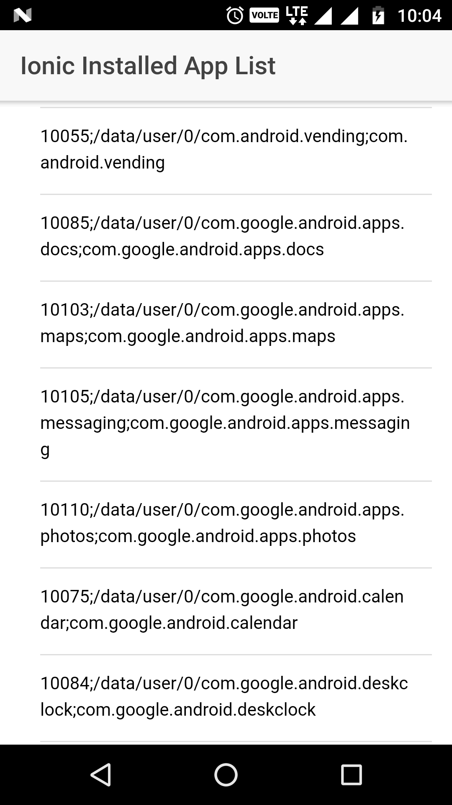

Get the List of Installed App using the Ionic 3.

Get App List tutorial using the below link.

https://ampersandacademy.com/tutorials/ionic-framework-3/get-list-of-installed-app-using-ionic-3-framework

